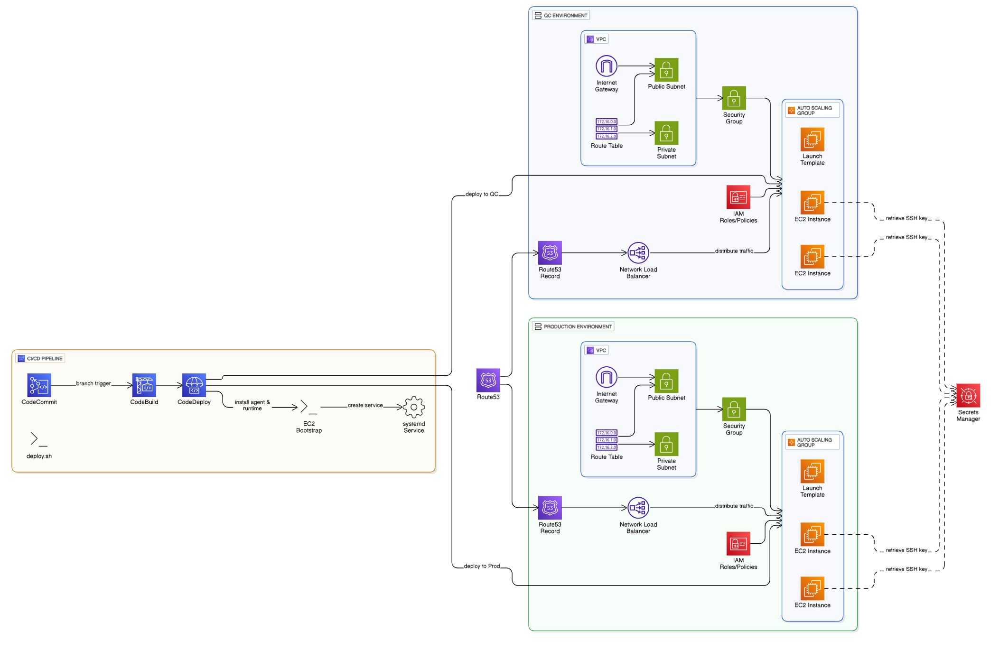

# AWS CI/CD Infrastructure Automation with Multi-Environment Support

<h3 align="center">This project implements a **CI/CD pipeline with AWS CLI & Bash scripting**.  
It provisions infrastructure and configures pipelines for **multi-environment deployment** (QC and Production).</h3>

## Architecture Diagram

### AWS CI/CD Infrastructure Automation Architecture

## Features

- **Infrastructure as Code (IaC)**

  - VPC with subnets (public & private), internet gateway, route tables.
  - Security Groups with SSH & self-referencing rules.
  - IAM Roles & Policies for EC2, CodeDeploy, CodePipeline.
  - Auto Scaling Group with EC2 Launch Template & scaling policies.
  - Network Load Balancer (NLB) + Route53 DNS records.
  - SSH Key managed in **AWS Secrets Manager**.

- **CI/CD Pipeline**

  - Source: CodeCommit (branch-based triggers).
  - Build: CodeBuild project with buildspec.
  - Deploy: CodeDeploy application with in-place deployment.
  - Pipeline: CodePipeline (Source → Build → Deploy).

- **Automation**
  - `deploy.sh` orchestrates provisioning for QC or Prod.
  - EC2 installs runtime + CodeDeploy agent.
  - `AfterInstall` creates **systemd service** for app runtime.

## Project Structure

├── autoscalinggroup.sh # Launch Template, Auto Scaling Group,Target Group, Listener  
├── dns.sh # Route53 DNS records  
├── deploy.sh # Orchestrator (QC/Prod configs + infra provisioning)  
├── security.sh # SSH key, Secrets Manager, Security Group  
├── conf-prod.sh # Production environment configuration  
├── conf-qc.sh # QC environment configuration  
├── vpc.sh # VPC, Subnets, Internet Gateway, Route Tables  
├── build.sh # CodeBuild project setup  
└── README.md # Documentation

## Scripts Execution Order (handled by deploy.sh)

VPC → Security → Auto Scaling → DNS

## Pipeline Flow

Push code → CodeCommit triggers → CodeBuild builds → CodeDeploy deploys → EC2 Auto Scaling instances + Route53 DNS.

## Technologies

AWS Services: EC2, VPC, Route53, IAM, CodeCommit, CodeBuild, CodeDeploy, CodePipeline, Auto Scaling, NLB, Secrets Manager

Tools: AWS CLI, Bash scripting, systemd

Concepts: Infrastructure as Code (IaC), CI/CD, multi-environment automation, DevOps best practices

## Author

Ahmed Heikal
Full Stack Engineer | Cloud & DevOps Specialist
